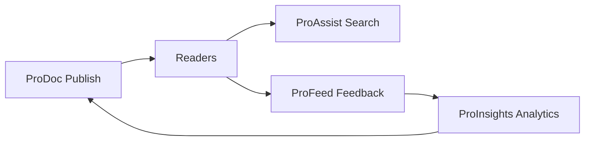

# Documentation Intelligence Loop in Production

Enterprise documentation fails when it ships once and never improves. The **Documentation Intelligence Loop** connects reading, feedback, analytics, and authoring into a measurable cycle.

## The loop

## Step 1 — Publish with structure

Authors ship MDX with consistent headings, tags, and categories so search and AI retrieval stay accurate.

## Step 2 — Capture reader signals

ProFeed collects helpful votes, stars, and section-level comments. Anchored feedback tells writers exactly which paragraph missed the mark.

## Step 3 — Prioritize with analytics

ProInsights surfaces pages with high traffic but low satisfaction, failed searches, and rising negative sentiment.

## Step 4 — Iterate and measure

Writers update source content, merge, and watch health scores improve in the next release window.

<Tip title="Portfolio note">
This blog post demonstrates release-style communication—clear outcomes, a diagram, and actionable steps—typical of SaaS documentation programs.
</Tip>

## Related

- [ProDocs Ecosystem Overview](/prodoc/platform-overview/ecosystem-overview)
- [Feedback lifecycle](/prodoc/profeed/feedback-lifecycle)
- [Documentation health score](/prodoc/proinsights/documentation-health-score)
