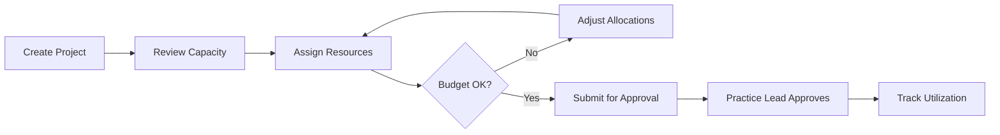

# How to Allocate Resources to a Project

This guide explains how project managers allocate **personnel and budget** to implementation projects using the ICP Resource Management module — commonly used during carrier onboarding, appeals rollout, and payment gateway migrations.

## Business scenario

**Project:** Carrier onboarding for Pacific Northwest Mutual (PNWM)  
**Duration:** 12 weeks (March–May 2026)  
**Budget:** $485,000  
**Team:** 2 implementation consultants, 1 data migration specialist, 1 QA lead, 0.5 FTE change management

The project manager must allocate resources without overcommitting team members who are shared across multiple active projects.

## Prerequisites

- **Project Manager** or **Resource Admin** role in ICP
- Project created in **Projects → Active Implementations**
- Resource pool populated with team members and their availability calendars

## Workflow

1. **Open the project** — Navigate to the PNWM onboarding project record
2. **Review capacity** — Check team availability for the project date range
3. **Create allocations** — Assign named resources with FTE percentage and date range
4. **Validate budget** — Confirm allocated hours x rates fit within project budget
5. **Submit for approval** — Route to Practice Lead for sign-off
6. **Monitor utilization** — Track actual vs. planned hours weekly

## Allocation table

Use this template when planning PNWM onboarding allocations:

| Resource | Role | FTE | Start | End | Hourly rate | Planned hours | Planned cost |
| -------- | ---- | --- | ----- | --- | ----------- | ------------- | ------------ |
| Sarah Chen | Lead Implementation Consultant | 0.75 | 2026-03-03 | 2026-05-23 | $185 | 360 | $66,600 |
| Marcus Webb | Implementation Consultant | 1.0 | 2026-03-03 | 2026-05-23 | $165 | 480 | $79,200 |
| Priya Nair | Data Migration Specialist | 0.5 | 2026-03-17 | 2026-04-25 | $175 | 160 | $28,000 |
| James Okonkwo | QA Lead | 0.5 | 2026-04-07 | 2026-05-16 | $155 | 160 | $24,800 |
| Lisa Park | Change Management | 0.25 | 2026-03-10 | 2026-05-23 | $145 | 120 | $17,400 |
| **Total** | | | | | | **1,280** | **$216,000** |

Remaining budget ($269,000) covers software licensing, travel, and contingency.

<Note title="Shared resources">
Sarah Chen is allocated at 0.75 FTE because she supports two concurrent projects. The system flags overallocation if her combined FTE exceeds 1.0 across all active projects.
</Note>

## Steps to allocate in ICP

### 1. Open Resource Planning

Navigate to **Projects → PNWM Carrier Onboarding → Resource Planning**.

### 2. Add a resource allocation

Click **Add Allocation** and complete the form:

- **Team member:** Select from the resource pool
- **Role on project:** Implementation Consultant, QA, etc.
- **FTE percentage:** 0.25 to 1.0
- **Start / end dates:** Must fall within project dates
- **Billable:** Yes (client-facing) or No (internal overhead)

### 3. Review the Gantt view

The Gantt chart displays all allocations across the project timeline. Conflicts appear as red bars when a team member is double-booked.

<Screenshot
  alt="Resource Gantt chart showing team allocations across a 12-week project timeline"
  caption="Figure 1 — Red indicators highlight overallocation conflicts."
/>

### 4. Submit for approval

Click **Submit Allocations**. The Practice Lead receives an approval request with a summary of FTE, cost, and any conflicts.

## Validation

| Check | Expected result |
| ----- | --------------- |
| No overallocation | No resource exceeds 1.0 combined FTE |
| Budget within threshold | Planned cost ≤ approved budget |
| Coverage gaps | No week with zero QA or implementation coverage during UAT |
| Approval recorded | Practice Lead approval timestamp present |

## Related documentation

- [How to Onboard a New Carrier](/prodoc/documentation-samples/onboard-new-carrier) — Full carrier onboarding procedure
- [Implementing Appeals Management Workflow](/prodoc/documentation-samples/implementation-appeals) — Example implementation project

---

[← Back to documentation samples](/prodoc/documentation-samples)
