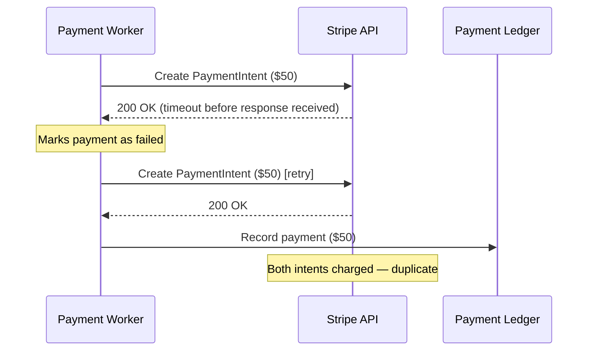

# DEF-2458 Duplicate Payment Processing

| Field | Value |
| ----- | ----- |
| **Defect ID** | DEF-2458 |
| **Severity** | High |
| **Status** | Fixed in v5.4.0 |
| **Affected versions** | 5.2.0 – 5.3.2 |
| **Reported** | January 28, 2026 |
| **Fixed** | March 10, 2026 |
| **Component** | Payment Processing / Stripe Integration |

## Summary

Under specific network retry conditions, the payment worker could submit a duplicate charge to Stripe when the initial request timed out but was actually processed. This resulted in members being charged twice for a single copay or premium payment.

## Impact

| Metric | Value |
| ------ | ----- |
| Affected tenants | 12 (Payment module enabled) |
| Duplicate charges identified | 847 |
| Total duplicate amount | $124,380.00 |
| Refunds processed | 847 (100%) |
| Member complaints | 23 |

<Warning title="Financial impact">
All identified duplicate charges have been refunded. Tenants should reconcile payment ledger entries for January–March 2026 to confirm no additional duplicates exist.
</Warning>

## Root cause

The payment worker's retry logic did not check whether the original Stripe `PaymentIntent` was created before retrying. When a network timeout occurred after Stripe accepted the request but before ICP received the response:

1. Worker marked the payment as `failed`
2. Retry logic created a **new** `PaymentIntent` with the same amount
3. Both intents succeeded, resulting in a double charge



## Workaround (v5.2.0 – v5.3.2)

Until upgrading to v5.4.0:

1. **Disable automatic retries** — Set `ICP_PAYMENT_RETRY_ENABLED=false` in environment
2. **Manual reconciliation** — Finance team runs daily duplicate detection script:

```bash
icp-cli payments detect-duplicates --since 2026-01-01 --output csv
```

3. **Member communication** — ProDoc Support provided a template letter for affected members

<Note title="Workaround side effect">
Disabling retries increases failed payment rates by approximately 2% for tenants with unstable network paths to Stripe. Upgrade to v5.4.0 as soon as possible.
</Note>

## Fix (v5.4.0)

The fix implements idempotency key persistence and pre-retry Stripe lookup:

1. Before creating a new `PaymentIntent`, the worker queries Stripe for an existing intent with the same idempotency key
2. If found, the worker links to the existing intent instead of creating a new one
3. Payment ledger entries are deduplicated by Stripe `PaymentIntent` ID (unique constraint added)

### Database change

See [Database Changes v5.4.0](/prodoc/documentation-samples/database-changes-v5-4-0) — migration `20260310_payment_idempotency.sql`.

## Verification

After upgrading to v5.4.0:

```bash
# Simulate timeout retry scenario
icp-cli payments test --scenario duplicate-retry --mode test
```

Expected: Single charge recorded despite simulated timeout and retry.

## Related documentation

- [Release Notes v5.4.0](/prodoc/documentation-samples/release-notes-v5-4-0)
- [Common Payment Processing Issues](/prodoc/documentation-samples/payment-troubleshooting)
- [Payment Gateway Configuration](/prodoc/documentation-samples/payment-gateway-configuration)

---

[← Back to documentation samples](/prodoc/documentation-samples)
