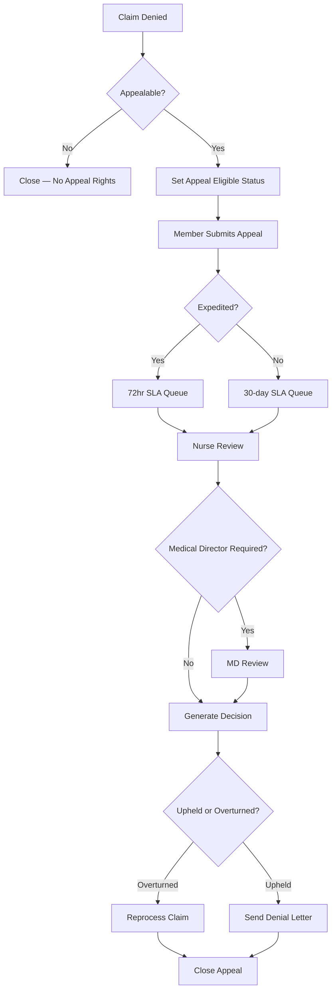

# Implementing Appeals Management Workflow

This implementation guide describes how to configure the **Appeals Management** module for a health plan that must comply with ERISA and state-mandated appeal timelines.

## Business scenario

**Client:** Mid-Atlantic Health Plan (MAHP)  
**Volume:** ~1,200 denied claims per month requiring member appeal rights  
**Regulatory requirement:** Level 1 appeal decision within 30 calendar days; expedited appeals within 72 hours for urgent care denials

MAHP's current process relies on email and spreadsheet tracking, causing missed deadlines and audit findings. The Appeals Management module automates intake, assignment, SLA tracking, and decision letter generation.

## Solution overview

The appeals workflow integrates with the existing claims adjudication engine:

1. A denied claim triggers an **Appeal Eligible** status when the denial reason code is appealable.
2. Members submit appeals via the member portal or CSR-assisted intake.
3. Appeals route to nurse reviewers or medical directors based on denial type and urgency.
4. Decisions sync back to the claim record and generate compliant notification letters.

<Tip title="Implementation timeline">
Allow **3–4 weeks** for configuration, UAT, and parallel run before decommissioning the legacy appeals tracker.
</Tip>

## Workflow diagram



## Configuration steps

### 1. Enable the appeals module

In **Admin Console → Modules**, enable **Appeals Management** for the production tenant.

```json
{
  "module": "appeals",
  "enabled": true,
  "tenant_id": "tenant-us-east-001"
}
```

### 2. Map denial reason codes

Configure which denial codes trigger appeal eligibility:

| Denial code | Description | Appealable | Default SLA |
| ----------- | ----------- | ---------- | ----------- |
| `D001` | Not medically necessary | Yes | 30 days |
| `D002` | Out of network | Yes | 30 days |
| `D003` | Timely filing | No | — |
| `D004` | Experimental treatment | Yes | 30 days |
| `D005` | Urgent care denial | Yes | 72 hours (expedited) |

### 3. Configure review queues

Create queues in **Admin Console → Appeals → Queues**:

- **Standard Appeals** — assigned to nurse reviewers (capacity: 25 open appeals per reviewer)
- **Expedited Appeals** — priority queue with SMS alerts at 48-hour mark
- **Medical Director Escalation** — for appeals exceeding $25,000 or involving experimental procedures

### 4. Set up letter templates

Upload decision letter templates for each outcome:

- Appeal upheld (denial stands)
- Appeal overturned (full approval)
- Appeal overturned (partial approval)
- Request for additional information

Templates must include member ID, claim number, appeal reference, and regulatory citation text approved by Legal.

### 5. Configure notifications

| Event | Recipient | Channel | Timing |
| ----- | --------- | ------- | ------ |
| Appeal received | Member | Email + portal | Immediate |
| SLA warning (80%) | Assigned reviewer | In-app + email | Automated |
| SLA breach | Appeals supervisor | Email + PagerDuty | Automated |
| Decision finalized | Member | Email + mailed letter | Within 24 hours |

## Validation

Complete the following UAT scenarios before go-live:

| Scenario | Steps | Expected result |
| -------- | ----- | --------------- |
| Standard appeal | Deny claim D001 → member submits appeal → nurse overturns | Claim reprocessed; overturn letter generated |
| Expedited appeal | Deny claim D005 → member requests expedited → decision in 72hr | SLA timer shows green until hour 72 |
| Non-appealable | Deny claim D003 | No appeal option in member portal |
| MD escalation | Submit appeal for D004 experimental | Routes to Medical Director queue |
| SLA breach alert | Simulate appeal open 29 days | Supervisor receives breach notification |

<Note title="Parallel run">
During the first 30 days post go-live, run appeals in both ICP and the legacy tracker. Reconcile daily counts until variance is below 0.5%.
</Note>

## Related documentation

- [Release Notes v5.4.0](/prodoc/documentation-samples/release-notes-v5-4-0) — Appeals SLA dashboard feature
- [Why Is My Claim Still Pending?](/prodoc/documentation-samples/claim-still-pending-kb) — Member-facing status explanations

---

[← Back to documentation samples](/prodoc/documentation-samples)
