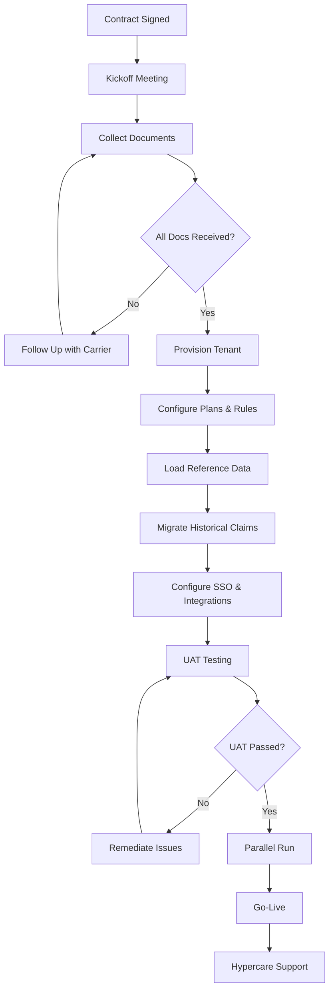

# How to Onboard a New Carrier

This guide describes the end-to-end process for onboarding a new **insurance carrier** onto the Insurance Claims Platform, from contract signature through production go-live.

## Overview

Carrier onboarding typically spans **8–14 weeks** and involves Legal, Implementation, Data Migration, and Customer Success teams. Each carrier receives a dedicated tenant configuration with custom plan benefits, provider networks, and adjudication rules.

**Typical stakeholders:**

| Role | Responsibility |
| ---- | -------------- |
| Customer Success Manager | Single point of contact for the carrier |
| Implementation Lead | Configures tenant, workflows, and integrations |
| Data Migration Specialist | Loads historical claims and member data |
| Carrier IT Liaison | Provides API credentials, network files, and UAT sign-off |

## Required documents

Collect the following before kickoff:

| Document | Owner | Format | Due |
| -------- | ----- | ------ | --- |
| Executed MSA and SOW | Legal | PDF | Before kickoff |
| Carrier profile questionnaire | Carrier | Excel template | Week 1 |
| Plan benefit schedules | Carrier | CSV or EDI 834 | Week 2 |
| Provider network file | Carrier | CSV (NPI, TIN, specialty) | Week 3 |
| Adjudication rules matrix | Carrier + Implementation | Excel | Week 4 |
| Historical claims extract | Carrier | CSV or EDI 837 | Week 5 |
| Member eligibility file | Carrier | EDI 834 or CSV | Week 5 |
| SSO/SAML metadata | Carrier IT | XML | Week 3 |
| PCI attestation (if payments enabled) | Carrier Compliance | PDF | Week 6 |
| UAT sign-off form | Carrier | Signed PDF | Week 12 |

<Warning title="Incomplete documents delay go-live">
Missing provider network files or adjudication rules are the most common cause of onboarding delays. Escalate to the carrier liaison if documents are more than 5 business days overdue.
</Warning>

## Onboarding flowchart

## Implementation checklist

### Phase 1 — Initiation (Weeks 1–2)

- [ ] Assign CSM and Implementation Lead
- [ ] Schedule kickoff with carrier stakeholders
- [ ] Create project in ICP Resource Management
- [ ] Allocate team resources ([How to Allocate Resources](/prodoc/documentation-samples/allocate-resources))
- [ ] Collect carrier profile questionnaire
- [ ] Confirm regulatory licenses and state filings

### Phase 2 — Configuration (Weeks 3–6)

- [ ] Provision tenant environment (staging + production)
- [ ] Load plan benefit schedules
- [ ] Import provider network file
- [ ] Configure adjudication rules matrix
- [ ] Set up denial reason codes and appeal mappings
- [ ] Configure SSO/SAML integration
- [ ] Enable payment gateway if applicable ([Payment Gateway Configuration](/prodoc/documentation-samples/payment-gateway-configuration))

### Phase 3 — Data migration (Weeks 5–8)

- [ ] Receive historical claims extract
- [ ] Run data validation and cleansing scripts
- [ ] Load member eligibility file
- [ ] Reconcile member counts (source vs. ICP)
- [ ] Reconcile open claim counts

### Phase 4 — Testing (Weeks 9–11)

- [ ] Execute UAT test plan (minimum 50 scenarios)
- [ ] Carrier IT liaison sign-off on SSO
- [ ] Performance test with production-volume batch
- [ ] Security scan and penetration test results reviewed

### Phase 5 — Go-live (Weeks 12–14)

- [ ] Parallel run with legacy system (minimum 2 weeks)
- [ ] Reconcile daily claim volumes (variance &lt; 0.5%)
- [ ] Cutover during approved maintenance window
- [ ] Hypercare support for 30 days post go-live
- [ ] Transition to steady-state support

<Tip title="Parallel run is non-negotiable">
Never cut over to production without a parallel run. Audit findings from skipped parallel runs have resulted in regulatory penalties for two carriers in 2025.
</Tip>

## Validation criteria

| Metric | Threshold |
| ------ | --------- |
| Member count reconciliation | ± 0.1% |
| Open claims reconciliation | ± 0.5% |
| UAT pass rate | 100% of critical scenarios |
| Adjudication accuracy (parallel run) | ≥ 99.5% match with legacy |
| SSO login success rate | ≥ 99% in UAT |

## Related documentation

- [Installing the Insurance Claims Platform](/prodoc/documentation-samples/installation-guide)
- [Database Changes v5.4.0](/prodoc/documentation-samples/database-changes-v5-4-0)
- [Release Notes v5.4.0](/prodoc/documentation-samples/release-notes-v5-4-0)

---

[← Back to documentation samples](/prodoc/documentation-samples)
