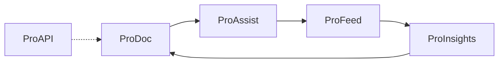

# ProDocs Ecosystem Overview

## What is ProDocs?

**ProDocs Ecosystem** is a unified platform to:

- Create documentation (ProDoc)
- Collect feedback (ProFeed)
- Analyze usage and feedback to improve docs (ProInsights)

Documentation is not static. ProDocs creates a continuous improvement cycle powered by real user feedback and analytics.

## Product comparison

| Product | Primary user | When to use it |
| ------- | ------------ | -------------- |
| **ProDoc** | Writers, developers, readers | Publish MDX docs, API references, tutorials, and release notes |
| **ProAssist** | Readers, support, onboarding | Ask AI, get citation-based answers, and smart search |
| **ProFeed** | Doc owners, support, triage admins | Capture reader feedback and track resolution status |
| **ProInsights** | Doc leads, product managers | Identify weak pages, sentiment trends, and improvement priorities |
| **ProAPI** | Developers, partner engineers | API reference, OpenAPI, SDK examples, and interactive requests |

Style governance, editorial review, and docs-as-code operations are integrated into **ProDoc** — not standalone products.

## Core components

- **ProDoc**: Documentation creation and publishing platform
- **ProAssist**: AI-powered documentation assistant
- **ProFeed**: Feedback collection engine (helpful / not helpful, stars, comments, highlights, attachments)
- **ProInsights**: Analytics and intelligence layer (trends, scoring, recommendations)
- **ProAPI**: Developer portal and API documentation

## Documentation Intelligence Loop

### How the loop works

1. **ProDoc**: Users read docs while trying to complete tasks.
2. **ProFeed**: Users give feedback (helpful / not helpful, stars, comments, section-level notes).
3. **ProInsights**: Feedback and usage signals are aggregated into actionable insights.
4. **Back to ProDoc**: Docs are improved based on insights and measured again.

## End-to-end walkthrough

1. Open [Getting started → Intro](/prodoc/getting-started/intro) and read a tutorial.
2. Submit feedback via the widget on any doc page (select a section anchor for precision).
3. Open [ProFeed](/profeed) to triage the submission — assign status, tags, and resolution notes.
4. Open [ProInsights](/proinsights) to see which pages accumulate negative sentiment.
5. Edit the MDX source under `content/docs/...`, merge, and watch trends improve.

## Repository map

| Area | Location | Purpose |
| ---- | -------- | ------- |
| Doc content | `content/docs/` | MDX source files and frontmatter |
| Doc routes | `app/docs/` | Next.js catch-all renderer |
| Doc utilities | `lib/docs/paths.ts`, `lib/mdx/compile-doc.tsx` | Slug discovery, nav groups, MDX compile |
| Feedback API | `app/api/feedback/` | Create, read, update feedback |
| Storage API | `app/api/storage/sign/` | Signed URLs for attachments |
| Supabase migrations | `supabase/migrations/` | Schema, RLS, anon read policies |
| ProFeed UI | `app/profeed/` | Triage dashboard |
| ProInsights UI | `app/proinsights/` | Analytics dashboard |

## What you can explore

- **Read docs**: start at [Getting Started → Intro](/prodoc/getting-started/intro)
- **Writing samples**: [Portfolio hub](/prodoc/samples)
- **Submit feedback**: use the floating widget on any `/prodoc/...` page
- **Triage feedback**: [ProFeed Admin](/profeed)
- **View analytics**: [ProInsights Dashboard](/proinsights)
