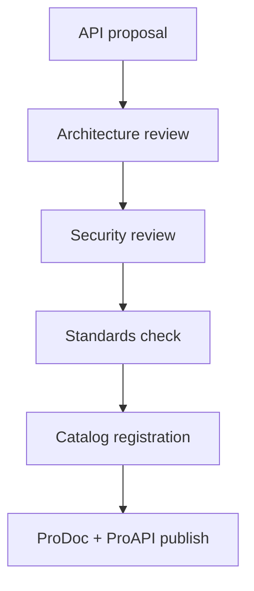

# API governance

API governance ensures every endpoint published in ProAPI meets security, consistency, and lifecycle standards before it reaches partner engineers. Governance connects platform teams, security reviewers, and doc owners in a repeatable approval path.

## Governance principles

1. **Single front door** — New APIs register in the [API catalog](/prodoc/proapi/api-catalog) before external publication
2. **Standards-first** — Designs conform to [API standards](/prodoc/proapi/api-standards) and [authentication standards](/prodoc/proapi/authentication-standards)
3. **Version discipline** — Breaking changes follow the [versioning strategy](/prodoc/proapi/versioning-strategy)
4. **Doc parity** — OpenAPI specs and MDX reference pages ship together

## Approval workflow

| Stage | Owner | Exit criteria |
| ----- | ----- | ------------- |
| Proposal | Service team | Problem statement, consumers, SLA |
| Architecture | Platform council | Boundary fit, dependency map |
| Security | Security engineering | Auth model, data classification |
| Standards | API guild | Naming, errors, pagination |
| Publication | Doc owner | Reference docs live, changelog updated |

<Admonition type="warning" title="Breaking changes">
Breaking changes require explicit deprecation windows documented in ProAPI and announced via release notes. Undocumented breaking changes trigger P0 [ProFeed](/prodoc/profeed/managing-customer-feedback) escalations.
</Admonition>

## Ownership model

Each catalog entry assigns:

- **Service owner** — Runtime reliability and roadmap
- **API steward** — Schema consistency and consumer support
- **Doc owner** — MDX reference accuracy and examples

<Collapse title="Exception process">
Emergency hotfixes may bypass full review with platform VP approval. Post-incident, retroactively update catalog metadata, docs, and changelog within five business days.
</Collapse>

## Related guides

- [ProAPI overview](/prodoc/proapi/overview)
- [API catalog](/prodoc/proapi/api-catalog)
- [ProDocs Ecosystem Overview](/prodoc/platform-overview/ecosystem-overview)
