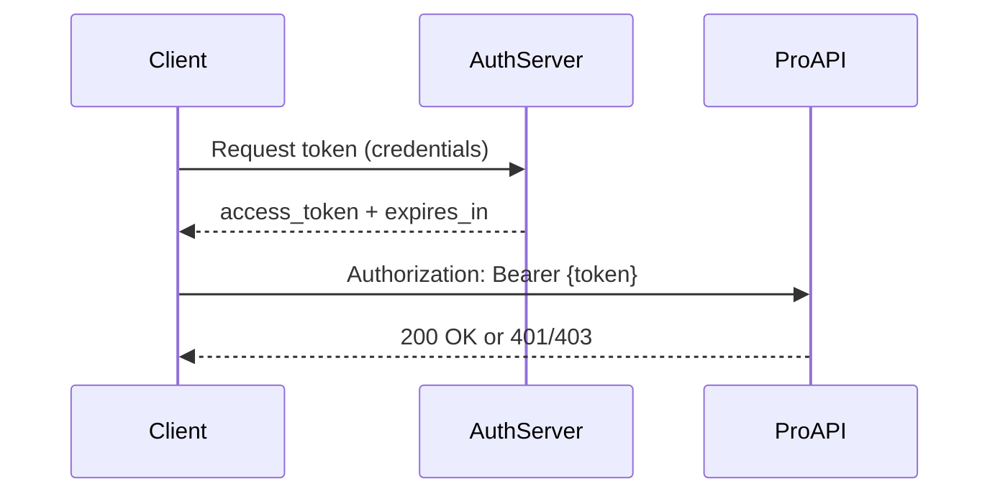

# Authentication standards

All ProAPI services implement authentication consistently so security reviewers and partner engineers share a common mental model. This guide defines supported mechanisms, scope design, and documentation requirements.

## Supported mechanisms

| Mechanism | Use case | Example |
| --------- | -------- | ------- |
| OAuth 2.0 (client credentials) | Server-to-server integrations | Feedback ingestion pipelines |
| OAuth 2.0 (authorization code) | User-delegated access | Admin dashboards |
| API key (scoped) | Low-risk read endpoints | Public catalog metadata |
| Session cookie | First-party ProDoc/ProFeed UI | Browser-based triage |

<Admonition type="danger" title="Secret handling">
Never embed service role keys or client secrets in client-side code. Server-only variables like `SUPABASE_SERVICE_ROLE_KEY` belong in deployment secrets—not MDX examples visible to readers.
</Admonition>

## Scope design

Scopes follow `{resource}:{action}` naming:

```text
feedback:read     — List and view feedback submissions
feedback:write    — Create and update feedback (admin)
storage:sign      — Generate signed attachment URLs
```

Document required scopes per endpoint in the MDX reference. Missing scope documentation is a top driver of integration support tickets and [ProFeed negative sentiment](/prodoc/proinsights/feedback-trends).

## Token lifecycle



- Access tokens expire within 60 minutes unless documented otherwise
- Refresh tokens supported for user-delegated flows
- Revocation endpoints documented for compromised credentials

## Security review checklist

<Collapse title="Pre-publication checklist">
- [ ] TLS 1.2+ required for all endpoints
- [ ] Rate limiting documented with 429 response
- [ ] Least-privilege scopes defined
- [ ] Audit logging for admin mutations
- [ ] CORS policy documented (`PRODOC_ALLOWED_ORIGINS` pattern)
</Collapse>

<Tip>
[ProAssist](/prodoc/proassist/overview) answers auth questions with citations to this page and service-specific guides—keep examples synchronized when scopes change.
</Tip>

## Related guides

- [API standards](/prodoc/proapi/api-standards)
- [ProAPI overview](/prodoc/proapi/overview)
- [Enable ProFeed feedback](/prodoc/prodoc/enable-profeed-feedback)
