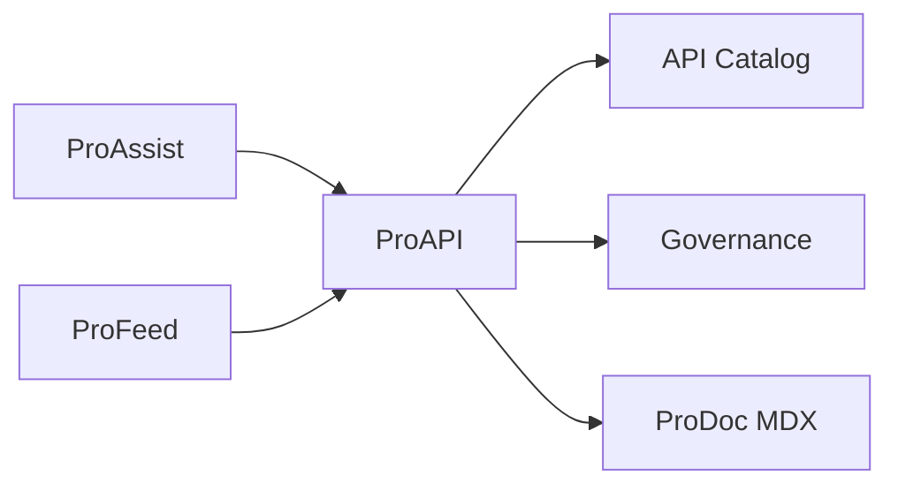

# ProAPI Overview

ProAPI is the developer-facing layer of the [ProDocs Ecosystem](/prodoc/platform-overview/ecosystem-overview). It centralizes API reference material, governance policies, and standards so partner engineers and internal teams ship integrations with confidence.

## What ProAPI provides

| Capability | Purpose |
| ---------- | ------- |
| API catalog | Discoverable registry of services, versions, and owners |
| Governance | Approval workflows for new endpoints and breaking changes |
| Standards | Naming, error models, pagination, and security conventions |
| Interactive docs | Try-it-now requests against sandbox environments |

ProAPI content lives alongside ProDoc MDX under `content/docs/proapi/` and integrates with OpenAPI specifications where published.

<Note>
API documentation gaps reported via [ProFeed](/prodoc/profeed/overview) on ProAPI pages flow into [ProInsights](/prodoc/proinsights/overview) for prioritization—especially auth and versioning topics.
</Note>

## Primary audiences

- **Partner engineers** integrating with public APIs
- **Platform teams** maintaining service boundaries and deprecation schedules
- **Security reviewers** validating authentication and scope models
- **Technical writers** publishing reference docs from OpenAPI sources

## Learn more

- [API governance](/prodoc/proapi/api-governance)
- [API catalog](/prodoc/proapi/api-catalog)
- [API standards](/prodoc/proapi/api-standards)
- [Versioning strategy](/prodoc/proapi/versioning-strategy)
- [Authentication standards](/prodoc/proapi/authentication-standards)
