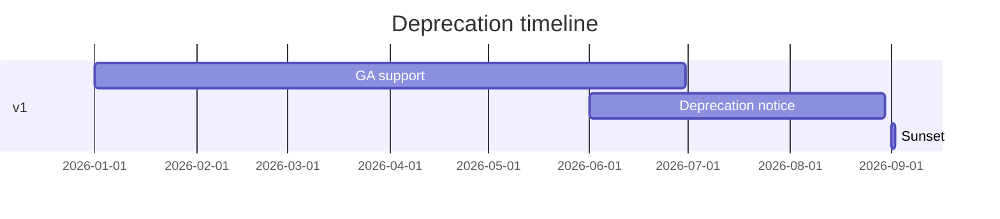

# Versioning strategy

ProAPI uses semantic versioning to communicate compatibility expectations. Partner engineers rely on version labels in the [API catalog](/prodoc/proapi/api-catalog) to plan upgrades without surprise breakages.

## Version scheme

| Change type | Version bump | Example |
| ----------- | ------------ | ------- |
| Backward-compatible addition | Minor (`1.1.0`) | New optional query param |
| Bug fix, no contract change | Patch (`1.0.1`) | Error message clarity |
| Breaking change | Major (`2.0.0`) | Removed field, renamed endpoint |

Breaking changes include: removing fields, changing types, altering auth requirements, or renaming URLs.

## URL and header versioning

<Tabs defaultValue="url">
  <Tab label="URL path" value="url">
    Preferred for major versions: `/api/v1/feedback`, `/api/v2/feedback`. Document migration paths in dedicated upgrade guides.
  </Tab>
  <Tab label="Header" value="header">
    `Accept-Version: 2026-03-01` for date-stamped releases. Useful when URL stability matters for long-lived integrations.
  </Tab>
</Tabs>

## Deprecation policy

Minimum deprecation window: **90 days** for GA APIs. Beta APIs may deprecate with 30 days notice.

<Warning>
Retire versions only after catalog status moves to `retired`, reference docs redirect to successors, and [ProInsights search analytics](/prodoc/proinsights/search-analytics) show negligible traffic on deprecated endpoints.
</Warning>

## Migration documentation

Every major release ships:

1. Changelog with breaking diffs
2. Step-by-step migration guide in ProDoc
3. Updated OpenAPI spec in the catalog
4. Sample code for common SDK patterns

## Related guides

- [API governance](/prodoc/proapi/api-governance)
- [API standards](/prodoc/proapi/api-standards)
- [ProDocs Ecosystem Overview](/prodoc/platform-overview/ecosystem-overview)
