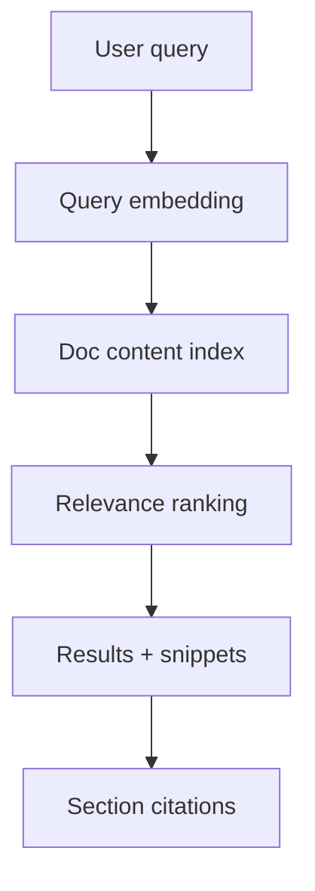

# AI search experience

ProAssist search goes beyond keyword matching. It interprets natural-language queries, retrieves relevant MDX sections, and ranks results by intent fit—not just term frequency.

## Search architecture

The index spans all published content under `content/docs/`, including ProFeed guides, [ProAPI references](/prodoc/proapi/overview), and tutorials.

## Query patterns that work well

<Tabs defaultValue="task">
  <Tab label="Task-oriented" value="task">
    "How do I enable ProFeed on a custom domain?" — ProAssist maps to setup tutorials and CORS configuration.
  </Tab>
  <Tab label="Conceptual" value="concept">
    "What is the documentation intelligence loop?" — Returns ecosystem overview and related concept pages.
  </Tab>
  <Tab label="Troubleshooting" value="troubleshoot">
    "Feedback widget not saving attachments" — Surfaces migration requirements and service role configuration.
  </Tab>
</Tabs>

## Result presentation

Each result includes:

- Page title and path (`/prodoc/...`)
- Relevant snippet with heading context
- Confidence indicator for ranking transparency
- One-click navigation to the cited section

<Tip>
Combine ProAssist search with [ProInsights search analytics](/prodoc/proinsights/search-analytics) to identify queries that return weak results—those gaps become ProFeed priorities.
</Tip>

## Enterprise considerations

- Search respects published content only; draft or private repos are excluded
- Results prioritize official product docs over sample pages unless scoped
- Rate limits apply per session to prevent abuse

## Related guides

- [ProAssist overview](/prodoc/proassist/overview)
- [Citation-based answers](/prodoc/proassist/citation-based-answers)
- [ProDocs Ecosystem Overview](/prodoc/platform-overview/ecosystem-overview)
