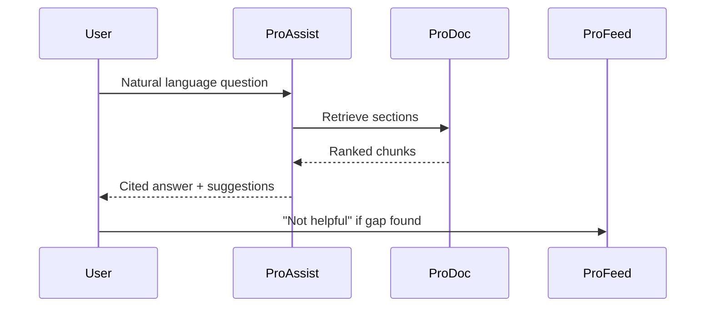

# Ask Documentation AI

Ask Documentation AI is ProAssist's conversational interface. Readers type questions in plain language and receive structured answers with inline citations, follow-up suggestions, and optional feedback capture.

## Conversation flow

1. User opens the ProAssist panel from any `/prodoc/...` page
2. Types or selects a smart suggestion
3. ProAssist retrieves relevant doc sections
4. Generates a cited answer with numbered sources
5. User can ask follow-ups within session context
6. Optional: submit ProFeed feedback if the answer was insufficient

## Guardrails

Enterprise deployments enforce:

- **Scope limits** — Answers restricted to indexed ProDoc content
- **No credential handling** — Never request or store API keys in chat
- **Transparency** — Confidence and source count displayed per response
- **Escalation path** — Clear link to human support when AI cannot answer

<Warning>
Do not paste production secrets, PII, or customer data into Ask Documentation AI. Treat the interface like any other support channel subject to data handling policies.
</Warning>

## Follow-up questions

ProAssist maintains short session context so follow-ups like "What environment variables do I need?" after an auth question inherit the prior topic. Context resets on navigation or session timeout.

<Tabs defaultValue="reader">
  <Tab label="Reader" value="reader">
    Ask task-focused questions. Click citations to verify steps before executing in production.
  </Tab>
  <Tab label="Support engineer" value="support">
    Copy citation links into ticket replies for consistent, doc-backed answers.
  </Tab>
  <Tab label="Doc owner" value="docowner">
    Monitor ProFeed items tagged from ProAssist sessions. Gaps indicate missing or unclear content.
  </Tab>
</Tabs>

## Related guides

- [Citation-based answers](/prodoc/proassist/citation-based-answers)
- [Smart suggestions](/prodoc/proassist/smart-suggestions)
- [ProDocs Ecosystem Overview](/prodoc/platform-overview/ecosystem-overview)
