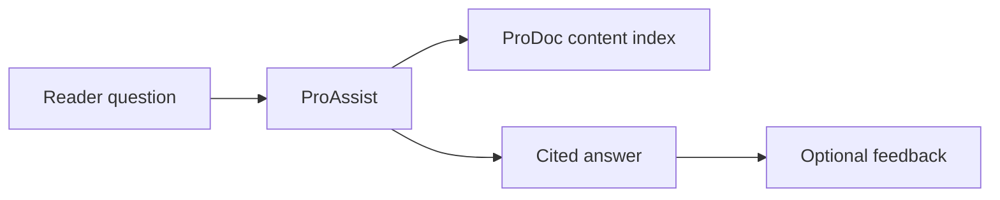

# ProAssist Overview

ProAssist is the AI layer of the [ProDocs Ecosystem](/prodoc/platform-overview/ecosystem-overview). It helps readers, support engineers, and onboarding teams find accurate answers faster—without leaving the documentation experience.

## What ProAssist does

Where traditional search returns a list of links, ProAssist understands intent and synthesizes answers grounded in your published ProDoc content. Every response includes citations so users can verify sources and dive deeper.

## Core capabilities

| Capability | Description |
| ---------- | ----------- |
| AI search | Semantic retrieval across MDX pages, API references, and tutorials |
| Citation-based answers | Responses link to exact doc sections with anchors |
| Smart suggestions | Contextual prompts based on current page and query history |
| Ask Documentation AI | Natural-language Q&A with enterprise guardrails |

## Who uses ProAssist

- **Readers** completing setup or integration tasks
- **Support teams** deflecting repeat questions with cited answers
- **Partner engineers** exploring API behavior before opening tickets
- **Onboarding cohorts** navigating large knowledge bases

<Note>
ProAssist complements—not replaces—curated documentation. When answers fall short, reader feedback flows to [ProFeed](/prodoc/profeed/overview) and informs [ProInsights](/prodoc/proinsights/overview) priorities.
</Note>

## Learn more

- [AI search experience](/prodoc/proassist/ai-search-experience)
- [Citation-based answers](/prodoc/proassist/citation-based-answers)
- [Smart suggestions](/prodoc/proassist/smart-suggestions)
- [Ask Documentation AI](/prodoc/proassist/ask-documentation-ai)
