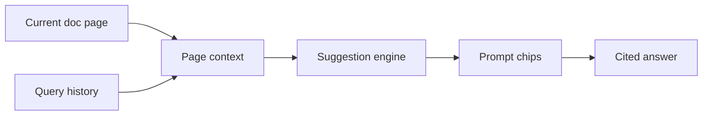

# Smart suggestions

Smart suggestions reduce time-to-answer by surfacing relevant questions before users finish typing. ProAssist analyzes the current page, recent queries, and common support patterns to propose high-value prompts.

## How suggestions work

On a page like [API governance](/prodoc/proapi/api-governance), suggestions might include "What approval gates apply to new endpoints?" or "How does versioning interact with deprecation?"

## Suggestion types

| Type | Trigger | Example |
| ---- | ------- | ------- |
| Page-aware | User on specific doc | "Explain this section in simpler terms" |
| Journey-aware | Sequential tutorial pages | "What's the next step after setup?" |
| Trend-aware | High-volume ProFeed themes | "Common auth setup mistakes" |

<Tip>
Review [search analytics](/prodoc/proinsights/search-analytics) quarterly to tune suggestion chips around queries with high volume but low satisfaction.
</Tip>

## UX guidelines

Suggestions appear as clickable chips below the search input. Selecting a chip pre-fills the query and returns a cited answer immediately—no retyping required.

<Note>
Suggestions never auto-execute destructive actions. They retrieve and explain documentation only. Operational changes still require following linked guides.
</Note>

## Customization for doc teams

Improve suggestion quality by:

1. Maintaining clear page titles and descriptions in frontmatter
2. Adding FAQ collapsible sections for recurring questions
3. Cross-linking within product areas (ProFeed ↔ ProInsights ↔ ProAPI)

## Related guides

- [ProAssist overview](/prodoc/proassist/overview)
- [Ask Documentation AI](/prodoc/proassist/ask-documentation-ai)
- [Documentation Intelligence Loop](/prodoc/concepts/documentation-intelligence-loop)
