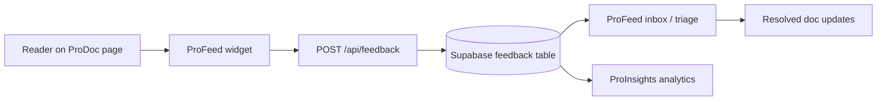

# Enable ProFeed feedback

Every ProDoc page includes a **ProFeed button in the bottom-right corner**. Click it to submit section-level feedback without leaving the page. After you submit, open the **Your feedback** tab in the same panel to update or delete your submission on that page.

This guide covers configuration for teams deploying the widget, plus where submissions land in ProFeed and ProInsights.

## Where feedback goes

When a reader submits feedback from a ProDoc page, data flows through the platform like this:



| Stage | What happens |
| ----- | ------------ |
| **Capture** | Widget sends page path, section anchor, sentiment, message, tags, and optional attachments |
| **Storage** | API persists rows in Supabase (`feedback`, `feedback_attachments`) |
| **Triage** | Doc owners review items in [ProFeed](/profeed) — assign status, add notes, resolve |
| **Analytics** | Aggregated signals appear in [ProInsights](/prodoc/proinsights/overview) for prioritization |

After triage, writers update the source MDX in ProDoc and close the loop.

## How feedback capture works

On any `/prodoc/...` page, the floating widget submits feedback to the ProFeed API and stores:

- `page_path` (the docs URL)
- `section_anchor` (the heading anchor, if selected)
- sentiment (helpful / not helpful) and/or star rating
- optional message, tags, highlights, and attachments

## Configuration checklist

### 1. Supabase project

Create a Supabase project and copy credentials from **Project Settings → API**:

```env
NEXT_PUBLIC_SUPABASE_URL=https://your-project.supabase.co
NEXT_PUBLIC_SUPABASE_ANON_KEY=your-anon-key
```

### 2. Run migrations

Apply SQL migrations in order from `supabase/migrations/`:

1. `001_*.sql` — base feedback schema
2. `002_*.sql` — RLS policies
3. `003_profeed_anon_read.sql` — allows anonymous read in ProFeed demo
4. `004_profeed_rich_feedback.sql` — rich text, highlights, attachments

Run via Supabase SQL editor or CLI.

### 3. CORS for cross-origin docs

If documentation is hosted on a different origin than the API, set allowed origins:

```env
PRODOC_ALLOWED_ORIGINS=http://localhost:3000,https://docs.example.com
```

When docs and API share the same Next.js app, `http://localhost:3000` is sufficient.

### 4. Attachments (optional)

For file uploads and signed download links:

```env
SUPABASE_SERVICE_ROLE_KEY=your-service-role-key
```

Keep this key **server-only** — never expose it in client bundles.

## Widget fields

| UI control | Stored as |
| ---------- | --------- |
| Helpful / Not helpful | sentiment flag |
| Star rating | numeric rating |
| Section picker | `section_anchor` |
| Message editor | HTML message body |
| Author / team chips | tags |
| Text highlight | highlight payload |
| File attach | `feedback_attachments` row + storage path |

## Verify

1. Open a docs page (for example, [ProDoc Overview](/prodoc/prodoc/overview)).
2. Submit a quick "Helpful" feedback with a section anchor selected.
3. Open [ProFeed](/profeed) and confirm the item appears with the correct page path and anchor.
4. Update status to **resolved** and add a triage note.

## Troubleshooting

| Symptom | Fix |
| ------- | --- |
| Widget submit fails with CORS error | Add your origin to `PRODOC_ALLOWED_ORIGINS` |
| ProFeed loads empty for anonymous users | Apply migration `003_profeed_anon_read.sql` |
| Attachments upload but won't download | Set `SUPABASE_SERVICE_ROLE_KEY` |
| Feedback not visible in ProInsights | Submit several items; refresh dashboard |

## Related

- [ProFeed Overview](/prodoc/profeed/overview) — triage product docs
- [Feedback resolution workflow](/prodoc/profeed/feedback-resolution-process) — admin workflow from submission to resolution
- [Documentation analytics](/prodoc/proinsights/documentation-analytics) — measure impact after fixes
