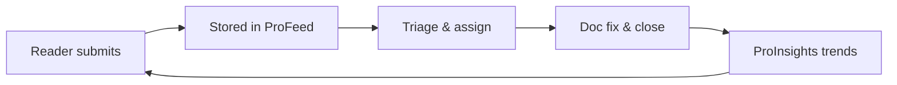

# Feedback lifecycle

Every piece of reader feedback in ProFeed follows a predictable lifecycle—from the moment a user clicks the widget on a ProDoc page to the point where improvements are measured in ProInsights. Understanding this flow helps doc owners, support teams, and product managers align on ownership and SLAs.

## Lifecycle stages

### 1. Capture

Readers submit feedback via the floating widget on any `/prodoc/...` page. Each submission includes `page_path`, optional `section_anchor`, sentiment (helpful / not helpful, stars), message text, tags, highlights, and attachments when enabled.

### 2. Persist

Submissions POST to `/api/feedback` and land in Supabase. ProFeed indexes them for filtering by status, team, writer, and page.

### 3. Triage

Doc owners review the queue at [/profeed](/profeed). Admins update status, add routing tags, and open detail views for highlights and attachments. See [Triage workflow](/prodoc/profeed/triage-workflow) for the operational guide.

### 4. Resolve

Confirmed issues trigger an MDX edit in `content/docs/...`, merge, and deploy. The ProFeed item moves to **closed** once the fix ships.

### 5. Measure

ProInsights aggregates sentiment before and after the change. A rising helpful ratio on the affected page confirms the loop closed successfully.

<Note>
ProFeed is one stage in the broader [ProDocs Ecosystem](/prodoc/platform-overview/ecosystem-overview). Feedback captured here feeds directly into ProInsights prioritization.
</Note>

## Roles and responsibilities

| Role | Responsibility |
| ---- | -------------- |
| Reader | Submit accurate, section-scoped feedback |
| Doc owner | Triage, prioritize, and resolve content gaps |
| Admin | Status updates, GitHub edit links, attachment access |
| Doc lead | Review ProInsights trends and set quarterly targets |

## Related guides

- [Managing customer feedback](/prodoc/profeed/managing-customer-feedback)
- [Feedback status workflow](/prodoc/profeed/feedback-status-workflow)
- [ProFeed overview](/prodoc/profeed/overview)
