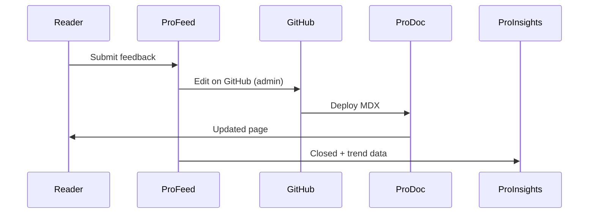

# Feedback resolution process

Resolution is where ProFeed delivers value: reader-reported gaps become shipped documentation improvements. This process connects ProFeed triage, ProDoc authoring, and ProInsights verification.

## Resolution workflow

1. **Confirm** — Open the feedback detail page. Review message, `section_anchor`, highlights, and attachments.
2. **Reproduce** — Click **View live doc** to see the reported section in context.
3. **Edit** — Admins use **Edit on GitHub** to open the MDX source (for example `content/docs/profeed/overview.mdx`).
4. **Review** — Submit a PR; follow [ProDoc authoring standards](/prodoc/prodoc/authoring-and-publishing).
5. **Deploy** — Merge to the configured branch (`NEXT_PUBLIC_GITHUB_DOCS_BRANCH`).
6. **Close** — Mark the ProFeed item **closed** with a brief resolution note.
7. **Verify** — Watch sentiment on the page in [ProInsights](/proinsights) over the next feedback cycle.

## Edit guidelines

When fixing from feedback:

- Address the **specific section** cited by `section_anchor`, not the entire page
- Preserve frontmatter conventions (`title`, `nav_order`, `team`)
- Add admonitions or collapsible FAQ sections for recurring confusion
- Cross-link to related guides rather than duplicating content

<Note>
GitHub edit links require `NEXT_PUBLIC_GITHUB_DOCS_REPO` and `NEXT_PUBLIC_GITHUB_DOCS_BRANCH` in `.env.local`. See [Triage workflow](/prodoc/profeed/triage-workflow) for configuration.
</Note>

## Won't-fix criteria

Close with rationale when:

- Feedback targets product behavior, not documentation
- Request duplicates an existing open item
- Change violates [API standards](/prodoc/proapi/api-standards) or security policy

Document the reason in resolution notes for audit purposes.

## Related guides

- [Managing customer feedback](/prodoc/profeed/managing-customer-feedback)
- [Feedback status workflow](/prodoc/profeed/feedback-status-workflow)
- [ProDocs Ecosystem Overview](/prodoc/platform-overview/ecosystem-overview)
