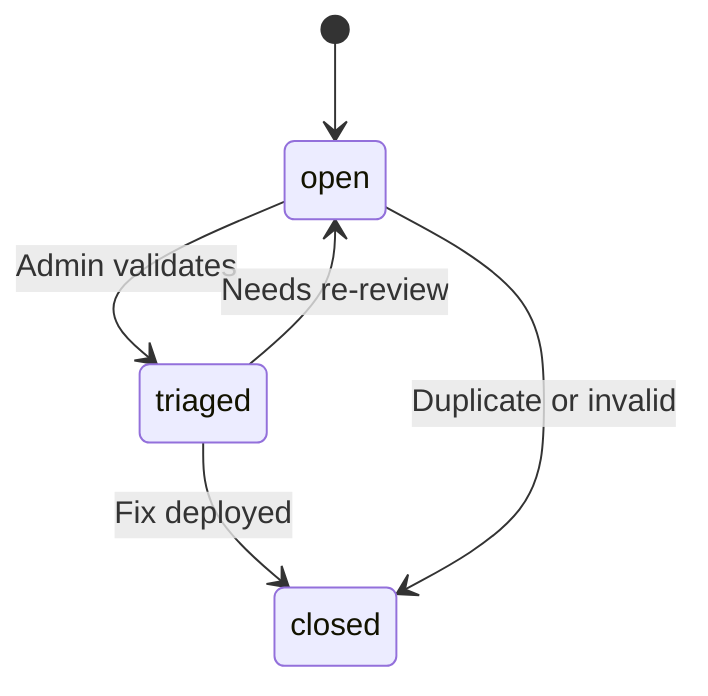

# Feedback status workflow

ProFeed uses a lightweight status model so doc teams can track backlog health without heavyweight issue trackers. Status changes are **admin-only**; all authenticated and anonymous users can read the queue.

## Status definitions

| Status | Meaning | Typical owner action |
| ------ | ------- | -------------------- |
| `open` | New or unreviewed submission | Initial triage within SLA |
| `triaged` | Validated, assigned, or in progress | Doc edit underway |
| `closed` | Resolved or won't-fix with rationale | Monitor ProInsights trend |



## Transition rules

<Admonition type="warning" title="Admin-only writes">
Only users signed in as **admin** can change status. Customer portal and anonymous readers have read access for transparency but cannot mutate records.
</Admonition>

Recommended transitions:

1. **open → triaged** — Issue confirmed; tag with team and writer
2. **triaged → closed** — MDX merged and deployed; resolution note added
3. **open → closed** — Duplicate, out of scope, or answered via support channel

Avoid leaving items in **triaged** indefinitely. ProInsights surfaces backlog size when statuses stall.

## Filtering and reporting

Use ProFeed filters to slice by status, page path, team, writer, or star rating. Export patterns for standups:

```text
open + page_path:/prodoc/getting-started/*  → onboarding backlog
triaged + team:ProAPI                       → API doc queue
closed + last_7_days                        → weekly throughput
```

<Collapse title="Status vs. Jira integration">
ProFeed statuses are intentionally minimal. Teams that sync to Jira should treat **triaged** as "linked externally" and keep ProFeed as the source of truth for doc-specific context (section anchors, highlights, attachments).
</Collapse>

## Related guides

- [Triage workflow](/prodoc/profeed/triage-workflow)
- [Feedback resolution process](/prodoc/profeed/feedback-resolution-process)
- [Feedback dashboard overview](/prodoc/profeed/feedback-dashboard-overview)
