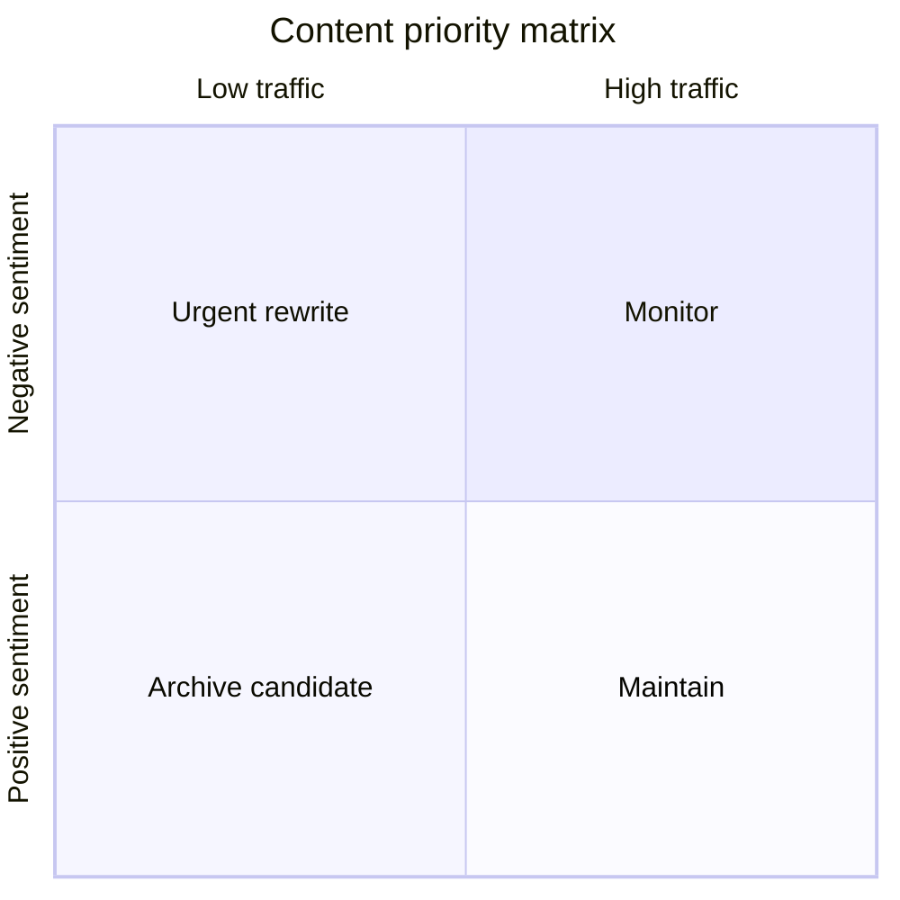

# Content performance

Content performance scoring helps doc teams answer a single question: which pages deliver value—and which create friction? ProInsights ranks `/prodoc/...` paths by combining traffic, engagement, and [ProFeed](/prodoc/profeed/overview) sentiment.

## Performance dimensions

| Dimension | Signal | Interpretation |
| --------- | ------ | -------------- |
| Reach | Page views | How many readers encounter the page |
| Engagement | Time on page, scroll depth | Whether readers consume content |
| Sentiment | Helpful vs not helpful ratio | Whether content meets expectations |
| Resolution | Closed ProFeed items / total issues | Whether fixes stick |

High reach + low sentiment = **priority rewrite candidate**.

## Top pages report

The ProInsights dashboard surfaces a ranked list of pages by feedback volume and negative sentiment. Use this report in weekly triage:

1. Sort by negative sentiment descending
2. Open matching items in [ProFeed](/profeed)
3. Inspect `section_anchor` values for pinpoint edits
4. Track post-fix sentiment over two feedback cycles

<Note>
The quadrant view is illustrative. In the live dashboard, combine numeric thresholds from [Dashboard guide](/prodoc/proinsights/dashboard-guide) with team SLAs.
</Note>

## Section-level analysis

When ProFeed submissions include `section_anchor`, ProInsights can highlight error-prone headings within otherwise healthy pages. Targeted admonitions or collapsible FAQs often resolve these without full rewrites.

<Collapse title="Sample improvement workflow">
Identify page → Read ProFeed comments → Edit MDX section → Deploy → Mark feedback closed → Verify sentiment lift in ProInsights within 14 days.
</Collapse>

## Related guides

- [Feedback trends](/prodoc/proinsights/feedback-trends)
- [Improve docs using insights](/prodoc/tutorials/improve-docs-using-insights)
- [Managing customer feedback](/prodoc/profeed/managing-customer-feedback)
