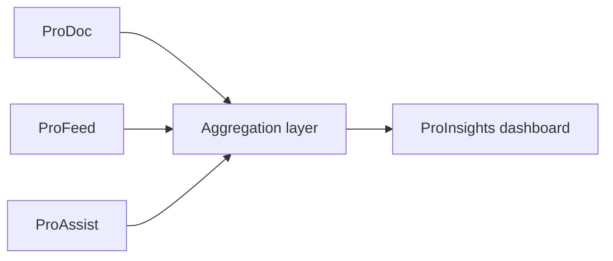

# Documentation analytics

Documentation analytics transforms raw usage and feedback signals into decisions doc teams can act on. ProInsights sits at the center of the [Documentation Intelligence Loop](/prodoc/platform-overview/ecosystem-overview)—aggregating ProDoc traffic patterns and [ProFeed](/prodoc/profeed/overview) submissions into a unified view.

## Data sources

| Source | Signals captured |
| ------ | ---------------- |
| ProDoc | Page views, session paths, time on page (where enabled) |
| ProFeed | Sentiment, stars, status, section anchors, tags |
| ProAssist | Search queries, answer satisfaction (where integrated) |
| ProAPI | Reference page views, try-it-now usage |

## Core metric categories

ProInsights organizes analytics into four pillars—each with a dedicated guide:

1. **[Search analytics](/prodoc/proinsights/search-analytics)** — Query volume, zero-result rate, click-through
2. **[Content performance](/prodoc/proinsights/content-performance)** — Page-level engagement and friction
3. **[Feedback trends](/prodoc/proinsights/feedback-trends)** — Sentiment shifts over time
4. **[Documentation health score](/prodoc/proinsights/documentation-health-score)** — Composite quality index

<Note>
When Supabase is not configured, ProInsights may display sample data so the UI remains explorable. Connect live credentials to see real aggregation from ProFeed submissions.
</Note>

## Using analytics in practice

Doc leads should review the [/proinsights](/proinsights) dashboard weekly:

- Compare top pages by traffic vs. negative sentiment
- Identify search queries with weak result quality
- Track backlog size from ProFeed status metrics
- Set quarterly targets using the health score trend

## Related guides

- [ProInsights overview](/prodoc/proinsights/overview)
- [Dashboard guide](/prodoc/proinsights/dashboard-guide)
- [Analyze with ProInsights](/prodoc/tutorials/analyze-with-proinsights)
