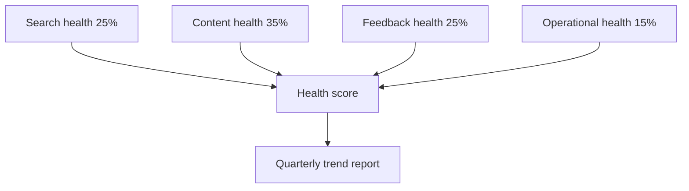

# Documentation health score

The documentation health score is ProInsights' executive-level KPI—a single index summarizing whether your documentation program is improving or regressing. It combines search quality, content performance, and feedback trends into one trackable number.

## Score components

| Component | Weight | Source metrics |
| --------- | ------ | -------------- |
| Search health | 25% | Zero-result rate, CTR, refinement rate |
| Content health | 35% | Top-page sentiment, engagement depth |
| Feedback health | 25% | Helpful ratio trend, star averages |
| Operational health | 15% | Backlog age, closure rate, SLA adherence |

Scores range from 0–100. Teams typically target **75+** for GA documentation programs, with product-specific baselines documented internally.

## Interpreting movement

<Tabs defaultValue="up">
  <Tab label="Score increasing" value="up">
    Resolution efforts are working. Document wins in [Insights case studies](/prodoc/insights/overview) and maintain triage cadence.
  </Tab>
  <Tab label="Score flat" value="flat">
    Fixes may address symptoms not root causes. Review [search analytics](/prodoc/proinsights/search-analytics) for persistent gaps.
  </Tab>
  <Tab label="Score decreasing" value="down">
    Investigate recent releases, API changes, or onboarding spikes. Prioritize pages in the content performance quadrant.
  </Tab>
</Tabs>

<Warning>
A rising health score with growing zero-result search rate indicates sentiment improvements on existing pages while new gaps go unaddressed. Review all four components—not just the headline number.
</Warning>

## Quarterly review template

1. Export health score trend (13-week rolling)
2. List top three negative-sentiment pages from [content performance](/prodoc/proinsights/content-performance)
3. Compare ProFeed backlog to prior quarter
4. Set targets tied to [Documentation Intelligence Loop](/prodoc/concepts/documentation-intelligence-loop) outcomes
5. Share summary with product leadership

<Collapse title="Demo vs live scoring">
Sample dashboard data produces illustrative scores only. Connect Supabase and accumulate real ProFeed submissions for meaningful trend lines.
</Collapse>

## Related guides

- [ProInsights overview](/prodoc/proinsights/overview)
- [Dashboard guide](/prodoc/proinsights/dashboard-guide)
- [ProDocs Ecosystem Overview](/prodoc/platform-overview/ecosystem-overview)
