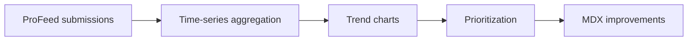

# Feedback trends

Feedback trends translate [ProFeed](/prodoc/profeed/overview) submissions into time-series signals. Doc leads use these charts to measure whether documentation investments move sentiment—and to catch regressions after product releases.

## Trend metrics

| Metric | Calculation | Use |
| ------ | ----------- | --- |
| Helpful ratio | helpful / (helpful + not helpful) | Overall doc satisfaction |
| Average stars | Mean star rating per page | Granular quality signal |
| Submission velocity | Feedback count per week | Engagement and issue discovery rate |
| Status backlog | open + triaged count | Triage capacity indicator |

## Reading sentiment charts

A declining helpful ratio on a stable-traffic page usually indicates:

- Product UI changed but docs lagged
- New edge case discovered by customers
- Ambiguous instructions in a specific tutorial step

Cross-reference `section_anchor` data in [ProFeed triage](/prodoc/profeed/triage-workflow) before rewriting entire pages.

<Tip>
After closing ProFeed items, watch the affected page's helpful ratio for 14 days. Sustained improvement confirms the [resolution process](/prodoc/profeed/feedback-resolution-process) worked.
</Tip>

## Backlog and throughput

ProInsights surfaces ProFeed status distribution when triage statuses are set (`open`, `triaged`, `closed`). Balance metrics:

- **Backlog growth** — intake exceeds resolution; add triage capacity
- **Stale triaged items** — assigned but not fixed; escalate in standup
- **Closure rate** — weekly closed count; track team throughput

<Admonition type="info" title="Tag-based segmentation">
Filter trends by ProFeed tags (team, writer) to compare ProAPI vs ProFeed vs onboarding content health independently.
</Admonition>

## Related guides

- [Documentation analytics](/prodoc/proinsights/documentation-analytics)
- [Content performance](/prodoc/proinsights/content-performance)
- [Documentation health score](/prodoc/proinsights/documentation-health-score)
