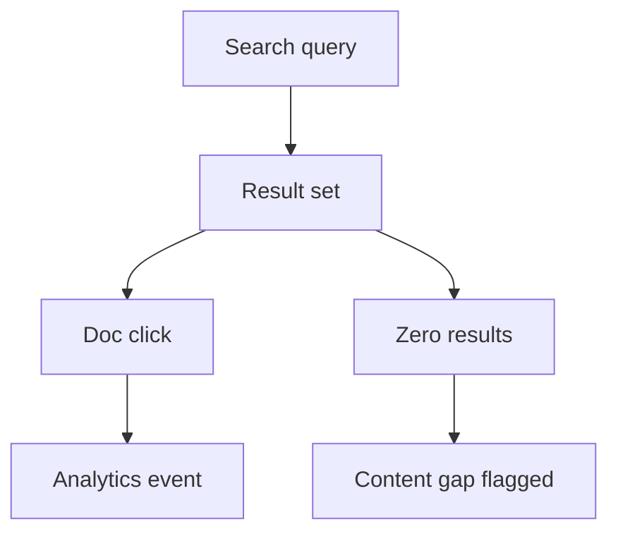

# Search analytics

Search analytics reveals what readers are looking for—and whether they find it. ProInsights tracks queries from [ProAssist AI search](/prodoc/proassist/ai-search-experience) and traditional doc search to expose content gaps before they become support tickets.

## Key metrics

| Metric | Definition | Action threshold |
| ------ | ---------- | ---------------- |
| Query volume | Unique searches per period | Top 10% = high demand topics |
| Zero-result rate | Queries with no matching docs | > 5% triggers content creation |
| Click-through rate | Searches leading to doc clicks | Low CTR = poor snippets or ranking |
| Refinement rate | Follow-up queries in same session | High rate = ambiguous first result |

## Interpreting search patterns

<Tabs defaultValue="spike">
  <Tab label="Volume spikes" value="spike">
    Sudden increases often follow product launches or incidents. Cross-reference [ProAPI changelog](/prodoc/updates/overview) and ship FAQ content within 24 hours.
  </Tab>
  <Tab label="Persistent gaps" value="gaps">
    Steady zero-result queries indicate missing docs. Create MDX pages or expand existing guides; register new APIs in the [catalog](/prodoc/proapi/api-catalog).
  </Tab>
  <Tab label="Low satisfaction" value="satisfaction">
    Queries with clicks but subsequent ProFeed "not helpful" votes signal findability without clarity. Improve section structure and add [citation-friendly headings](/prodoc/proassist/citation-based-answers).
  </Tab>
</Tabs>

<Tip>
Pair search analytics with [smart suggestions](/prodoc/proassist/smart-suggestions) tuning—promote chips for high-volume queries that already have strong doc coverage.
</Tip>

## Reporting cadence

- **Weekly** — Review top 20 queries and zero-result list
- **Monthly** — Trend report for doc lead staff meeting
- **Quarterly** — Correlate search gaps with [documentation health score](/prodoc/proinsights/documentation-health-score) movement

## Related guides

- [Documentation analytics](/prodoc/proinsights/documentation-analytics)
- [Content performance](/prodoc/proinsights/content-performance)
- [ProDocs Ecosystem Overview](/prodoc/platform-overview/ecosystem-overview)
