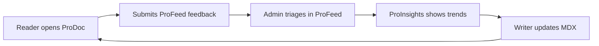

# End-to-end loop

This tutorial walks through the complete **Documentation Intelligence Loop** on this demo site — read, feedback, triage, analytics, and improvement.

## Overview

## Step 1 — Read documentation

Open [ProFeed Overview](/prodoc/profeed/overview) and read the page as a new user would. Note anything unclear — missing steps, undefined terms, or broken cross-links.

## Step 2 — Submit feedback

Click the floating **Feedback** widget:

1. Select **Not helpful**
2. Choose the **Data flow** section anchor
3. Add a comment: "Need a diagram showing widget → API → database"
4. Submit

The widget POSTs to `/api/feedback` with your `page_path` and `section_anchor`.

## Step 3 — Triage in ProFeed

1. Open [/profeed](/profeed) and sign in as **admin**
2. Click **Details** on your submission (or open `/profeed/feedback/{id}`)
3. Review the full message, section anchor, and highlights
4. Set status to **triaged**
5. Click **View live doc** to confirm the issue in context
6. Click **Edit on GitHub** (admin only) to open `content/docs/profeed/overview.mdx` in GitHub

Non-admin users can view the same detail page but **Edit on GitHub** is disabled.

## Step 4 — Analyze in ProInsights

1. Open [/proinsights](/proinsights)
2. Check if `/prodoc/profeed/overview` appears in top pages
3. Review sentiment split for that path
4. Confirm the feedback volume is trackable after multiple submissions

## Step 5 — Fix the documentation

1. From the feedback detail page, click **Edit on GitHub** (admin)
2. Add a Mermaid or prose description of the widget → API → Supabase flow
3. Link to [Triage workflow](/prodoc/profeed/triage-workflow) for admin steps
4. Merge the PR and verify at `/prodoc/profeed/overview`

Alternatively, edit `content/docs/profeed/overview.mdx` locally in your IDE — the GitHub link resolves the same file path automatically.

## Step 6 — Close and measure

1. Mark the ProFeed item **closed**
2. Ask a colleague to re-read the page and submit **Helpful** feedback
3. Watch ProInsights for improved sentiment on that page over the next cycle

## What you learned

| Stage | Product | Outcome |
| ----- | ------- | ------- |
| Read | ProDoc | Structured MDX content |
| Feedback | ProFeed | Section-level reader signal |
| Triage | ProFeed | Actionable work items |
| Analytics | ProInsights | Priority and trend data |
| Fix | ProDoc | Improved MDX in Git |

This is the core value of the ProDocs Ecosystem — documentation that improves itself through reader signal.

## Continue exploring

- [Writing samples](/prodoc/samples) — portfolio deliverables
- [Ecosystem overview](/prodoc/platform-overview/ecosystem-overview) — architecture and repo map
